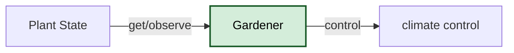

# Smart Greenhouse Management System

User can monitor the state of the Greenhouse example, its climate, its soil state and plant states

## Entities

1. Gardener (User)
2. Greenhouse
3. Plant (Example, tomatoes)



## Actors
1. **Gardener / Botanist:** Manages the plants, registers new additions, and monitors their overall health.
2. **Automated Watering Controller:** An automated system that reads plant statuses to trigger physical greenhouse actions.
3. **System Admin:** Manages user access and ensures system uptime.

## Use Cases
1. **Register a New Plant:** The Gardener adds a new plant or bed to the greenhouse inventory with its initial status and location.
2. **Check Plant Status:** The Automated Watering Controller retrieves the list of plants and checks their status to determine if any require immediate watering.
3. **Update Plant Health:** The Gardener updates the status of a specific plant from "healthy" to "needs_attention" after a physical inspection.

## Future Extensions
The system will later benefit from another microservice to handle raw temperature/humidity sensor data, event-driven communication to trigger automatic watering notifications, role-based security to restrict access to the controllers, and system monitoring to track long-term greenhouse health trends.

## How to Start the Server

1. **Build the Docker Image**

    Navigate to the project directory and build the Docker image using the following command:
```bash
    docker build -t simple-greenhouse-api .
```

2. **Run the Docker Container**

    Start the container and map port 8080 on your host machine to port 5000 inside the container:
```bash
    docker run -d --name greenhouse-app -p 8080:5000 simple-greenhouse-api
```
The server is now running and accessible at http://localhost:8080.

## Running the Automated Test Script
To verify that the API is functioning correctly, you can run the included test_api.py script. This script acts as a client that sequentially tests all CRUD (Create, Read, Update, Delete) endpoints for both Greenhouses and Plants, and it outputs the exact requests and responses.

1. Ensure the Docker container is running (see steps above).

2. Install the required requests package:

    `pip install requests`


3. Execute the test script:

    `python test_api.py`


## Expected Output

The script will print out a structured log of:

POST requests creating a Greenhouse and a Plant.

GET requests listing and retrieving specific items.

PUT requests updating the Greenhouse.

DELETE requests cleaning up the created data.

The corresponding HTTP status codes (e.g., 201 Created, 200 OK, 204 No Content) and JSON payloads.

```bash
==================================================
 GREENHOUSE ENDPOINTS 
==================================================

> [POST] http://localhost:8080/greenhouses
Payload: {
  "name": "Tropical Zone"
}
Status Code: 201
Response: {
  "id": 1,
  "name": "Tropical Zone"
}

> [GET] http://localhost:8080/greenhouses
Status Code: 200
Response: [
  {
    "id": 1,
    "name": "Tropical Zone"
  }
]

> [GET] http://localhost:8080/greenhouses/1
Status Code: 200
Response: {
  "id": 1,
  "name": "Tropical Zone"
}

> [PUT] http://localhost:8080/greenhouses/1
Payload: {
  "name": "Tropical Zone Updated"
}
Status Code: 200
Response: {
  "id": 1,
  "name": "Tropical Zone Updated"
}

==================================================
 PLANT ENDPOINTS 
==================================================

> [POST] http://localhost:8080/plants
Payload: {
  "name": "Monstera Deliciosa",
  "species": "Monstera",
  "greenhouse_id": 1
}
Status Code: 201
Response: {
  "greenhouse_id": 1,
  "id": 1,
  "name": "Monstera Deliciosa",
  "species": "Monstera"
}

> [GET] http://localhost:8080/plants
Status Code: 200
Response: [
  {
    "greenhouse_id": 1,
    "id": 1,
    "name": "Monstera Deliciosa",
    "species": "Monstera"
  }
]

> [GET] http://localhost:8080/plants/1
Status Code: 200
Response: {
  "greenhouse_id": 1,
  "id": 1,
  "name": "Monstera Deliciosa",
  "species": "Monstera"
}

==================================================
 CLEANUP / DELETE ENDPOINTS 
==================================================

> [DELETE] http://localhost:8080/plants/1
Status Code: 204
Response: 

> [GET] http://localhost:8080/plants/1
Status Code: 404
Response: {
  "error": "Plant not found"
}

> [DELETE] http://localhost:8080/greenhouses/1
Status Code: 204
Response: 

> [GET] http://localhost:8080/greenhouses/1
Status Code: 404
Response: {
  "error": "Greenhouse not found"
}
```

## Why port mapping -p 8085:5000

When a user sends a request to  **localhost:8085** , the traffic first reaches the host machine, not the Flask process directly. The  -p 8085:5000  mapping tells Docker to listen on port 8085 on the host and forward that traffic into port 5000 inside the container, which is where the Flask app is exposed in this image.

Port mapping is required because the container has its own network namespace, so port 5000 inside the container is separate from port 5000 or any other port on the host. Without  -p 8085:5000 , the app may still be running inside the container, but you would not be able to reach it from your browser using  localhost:8085 .

Using 8085 on the host is simply a convention, often made to avoid conflicts with other services already using common ports. Docker then bridges that external host port to the container’s internal Flask port, allowing the client and the application to communicate even though they live in different network contexts.