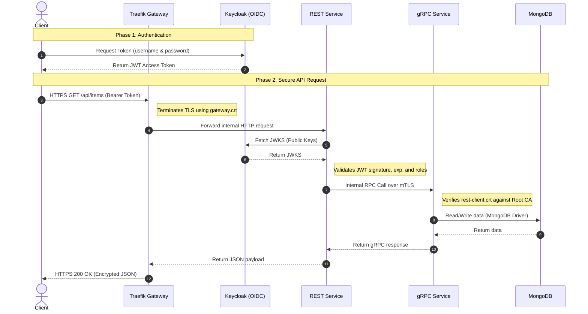

# Smart Greenhouse Management System: Phase 5 (Security)

**Source Code Repository:** [greenhouse-management-dsa-lab](https://github.com/nischal-anhalt/greenhouse-management-dsa-lab)

## 1. Executive Summary
This document details Phase 5 of the Smart Greenhouse Management System, focusing on implementing a robust, multi-layered security architecture. Moving away from the assumption that internal networks are inherently safe, this phase introduces an HTTPS gateway, OpenID Connect (OIDC) for identity management, JSON Web Token (JWT) validation, and Mutual TLS (mTLS) for secure inter-service communication.

## 2. Secure Request Path & Architecture
The architecture now follows a strictly controlled request path to ensure end-to-end security[cite: 1]. The following sequence diagram illustrates both the authentication phase and the secure data retrieval phase.



**Step-by-Step Breakdown:**
1.  **Authentication:** The client authenticates with Keycloak and receives a JWT[cite: 1].
2.  **Client Request:** The client sends an HTTPS request to `https://localhost:8443/api/items`[cite: 1].
3.  **Edge Termination:** The Traefik gateway terminates the HTTPS connection using the gateway certificate[cite: 1].
4.  **Token Validation:** The REST service intercepts the request and validates the provided JWT Bearer token against Keycloak's public keys[cite: 1].
5.  **Internal Routing (mTLS):** Upon successful validation, the REST service initiates a connection to the internal gRPC service over Mutual TLS[cite: 1].
6.  **Data Retrieval:** The gRPC service verifies the REST client's certificate, processes the request, reads/writes to MongoDB, and returns the JSON response back through the gateway[cite: 1].

## 3. PKI and Certificate Management
To facilitate this security model, an offline Root Certificate Authority (CA) was established to issue role-specific certificates:
*   **Root CA (`ca.crt` / `ca.key`):** A self-signed root authority kept offline and secure, used solely to create and sign all other certificates in the stack.
*   **Gateway Certificate (`gateway.crt`):** Used by Traefik to present a trusted identity to external clients and terminate HTTPS traffic at the edge.
*   **REST Client Certificate (`rest-client.crt`):** Used by the Flask REST API to authenticate itself as a trusted client when communicating with the backend.
*   **gRPC Server Certificate (`grpc-service.crt`):** Used by the Python gRPC backend to prove its identity to the REST service and establish a secure mTLS server.

## 4. Token Validation & mTLS Configuration
*   **JWT Claims:** The REST service strictly verifies the presence of the Bearer token, its cryptographic signature, the issuer (`iss`), and the intended audience (`aud`) before processing any application logic.
*   **mTLS Impact:** Previously, the REST service connected to the gRPC backend over a plain-text, unauthenticated channel. With mTLS enabled, the connection is now fully encrypted, and both the client (REST) and server (gRPC) mutually cryptographically verify each other's identity using certificates signed by our custom Root CA.

---

## 5. Normal Operation Flow
Testing the baseline happy-path behavior with a valid token.

**1. Generate JWT Token:**
```bash
KC="http://localhost:8088/realms/dsa-lab/protocol/openid-connect"

curl -s \
  -d "client_id=rest-api" \
  -d "grant_type=password" \
  -d "username=alice" \
  -d "password=secret" \
  "${KC}/token" | jq -r .access_token > token.jwt
```

**2. Access Denied (Without Token):**
```bash
curl --cacert security/certs/ca.crt https://localhost:8443/api/items

{"error":{"code":"missing_token","message":"Bearer token is required."}}
```

**3. Access Granted (With Valid Token):**
```bash
curl --cacert security/certs/ca.crt \
  -H "Authorization: Bearer $(cat token.jwt)" \
  https://localhost:8443/api/items

[{"id":"01d438e5-e9ab-4726-9c76-b9a340aca276","location":"Zone 1","name":"observability-plant-111","status":"healthy"}...]
```

---

## 6. Threat Simulations
Evidence that the system actively blocks malicious or misconfigured requests.

### Test 1: Missing Bearer Token
**Objective:** Attempt to access the API without providing authentication credentials.
```bash
curl -i --cacert security/certs/ca.crt https://localhost:8443/api/items

HTTP/2 401 
content-type: application/json

{"error":{"code":"missing_token","message":"Bearer token is required."}}
```
*Result:* Success. The system correctly returns a `401 Unauthorized` response.

### Test 2: Tampered Bearer Token
**Objective:** Simulate an attacker attempting to modify a token payload or signature by appending a random character (`x`).
```bash
BAD_TOKEN="$(cat token.jwt)x"

curl -i --cacert security/certs/ca.crt \
  -H "Authorization: Bearer ${BAD_TOKEN}" \
  https://localhost:8443/api/items

HTTP/2 401 
content-type: application/json

{"error":{"code":"invalid_token","message":"Signature verification failed"}}
```
*Result:* Success. The cryptographic signature check fails, rejecting the request with `401 Unauthorized`.

### Test 3: mTLS Failure (Compromised Client)
**Objective:** Simulate a scenario where the REST service loses its valid mTLS client certificate, simulating an unauthorized internal container trying to access the gRPC backend.
*Action:* Modified `compose.yaml` to point to a non-existent certificate (`/certs/invalid-cert-path.crt`).

```bash
curl -i --cacert security/certs/ca.crt \
  -H "Authorization: Bearer $(cat token.jwt)" \
  https://localhost:8443/api/items

HTTP/2 502 
Bad Gateway
```
*REST Service Logs:*
```text
rest-service-1  | FileNotFoundError: [Errno 2] No such file or directory: '/certs/invalid-cert-path.crt'
```
*Result:* Success. The backend refuses to establish the connection without a valid client certificate, preventing internal lateral movement.

---

## 7. Curiosity Extension: Role-Based Access Control (RBAC)
**Implementation:** Enhanced the API security by implementing RBAC. While any authenticated user can read data, the `POST /items` endpoint is now restricted exclusively to users possessing the `ROLE_USER` permission.

**Test Results:**
*   **User 'Bob' (Role: GUEST):** Attempted to create a new plant. The application successfully extracted the roles from the JWT and rejected the request.
    ```bash
    HTTP/2 403 
    {"error":{"code":"forbidden","message":"User bob lacks the required ROLE_USER permission."}}
    ```
*   **User 'Alice' (Role: USER):** Attempted to create a new plant. The application verified the correct role and processed the request successfully.
    ```bash
    HTTP/2 201 
    {"created_count":1,"message":"created through gRPC","total_count":1}
    ```

## 8. Conclusion: Defense in Depth
This lab demonstrates that security in distributed systems is not reliant on one single mechanism. We established a true Defense in Depth strategy: TLS at the edge protects data in transit from the client to the gateway. OIDC and JWT validation ensures the user is identified and authorized before accessing REST endpoints. Finally, mTLS inside the stack authenticates the services to each other, ensuring that even if an attacker breaches the internal Docker network, they cannot exploit the backend database without the proper cryptographic keys.